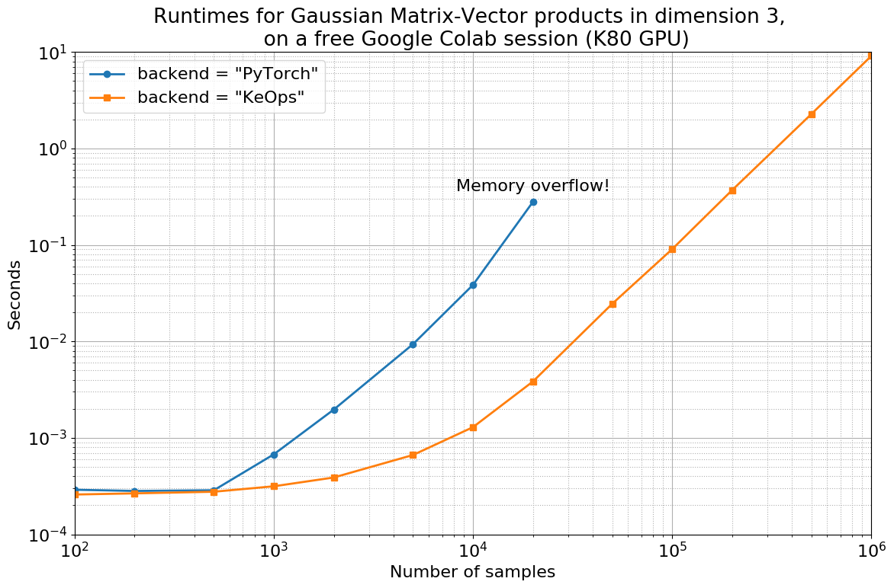

Why using KeOps?
================

Scalable computations kernel operations
---------------------------------------

The very first motivation of KeOps was to compute fast and scalable Gaussian convolutions (aka. **RBF kernel product**). Given:

- a target point cloud :math:`(x_i)_{i=1}^N \in  \mathbb R^{N \times D}`
- a source point cloud :math:`(y_j)_{j=1}^M \in  \mathbb R^{M \times D}`
- a signal or vector field :math:`(b_j)_{j=1}^M \in  \mathbb R^{M \times E}` attached to the :math:`y_j`'s

we strive to compute efficiently the array :math:`(a_i)_{i=1}^N \in  \mathbb R^{N \times E}` given by

.. math::
    a_i =  \sum_j K(x_i,y_j) b_j,  \qquad i=1,\cdots,N

where :math:`K(x_i,y_j) = \exp(-\|x_i - y_j\|^2 / \sigma^2)`. Another useful quantity that we need to compute is the derivative of :math:`a_i` with respect to the :math:`x_i`'s,

.. math::
   a_i' =  \sum_j K'(x_i,y_j) b_j,  \qquad i=1,\cdots,N

where :math:`K'(x_i,y_j) = \partial_x \exp(-\|x_i - y_j\|^2 / \sigma^2)`. KeOps allows you to compute both :math:`a_i` and :math:`a_i'` efficiently with its automatic differentiation module - that is, without needing to code explicitly the formula :math:`K'(x_i,y_j) = -2(x_i - y_j) \exp(-\|x_i - y_j\|^2 / \sigma^2)`.

**Today, KeOps can be used on a broad class of formulas** as explained below in Section :ref:`part.formula`.

High performances
-----------------

In recent years, Deep Learning frameworks such as `PyTorch  <http://pytorch.org>`_, `TensorFlow <http://www.tensorflow.org>`_ or `Theano <http://deeplearning.net/software/theano/>`_ have evolved into fully-fledged applied math libraries: With negligible overhead, these tools bring **automatic differentiation** and **seamless GPU support** to research communities used to array-centric frameworks such as Matlab and numpy.

Unfortunately, though, *no magic* is involved: optimised CUDA codes still have to be written for every atomic operation provided to end-users, and supporting all the standard mathematical computations thus comes at a **huge engineering cost** for the developers of the main frameworks.  As of 2018, this considerable effort has been mostly restricted to the operations needed to implement Convolutional Neural Networks: linear algebra routines and *grid* convolutions.  **With KeOps, we are providing the brick that several research communities were missing.**

**The baseline example.**
A standard way of computing Gaussian convolutions in array-centric frameworks is to create and store in memory the full M-by-N kernel matrix :math:`K_{i,j}=K(x_i,y_j)`, before computing :math:`(a_i) = (K_{i,j}) (b_j)` as a standard matrix product.  Unfortunately, for large datasets (say, :math:`M,N \geqslant 10,000`), this becomes intractable: **large matrices just don't fit in GPU memories**.

The purpose of KeOps, simply put, is to **let users break through this memory bottleneck** by computing **online reductions**:

.. _part.formula:

A generic framework that fits your needs
----------------------------------------

KeOps supports **generic operations**, way beyond the simple case of kernel convolutions.
Let's say that you have at hand:

- a collection :math:`p^1, p^2, ..., p^P` of vectors.
- a collection :math:`x^1_i, x^2_i, ..., x^X_i` of vector sequences, indexed by an integer :math:`i` ranging from 1 to N.
- a collection :math:`y^1_j, y^2_j, ..., y^Y_j` of vector sequences, indexed by an integer :math:`j` ranging from 1 to M.
- a vector-valued function :math:`f(p^1, p^2,..., x^1_i, x^2_i,..., y^1_j, y^2_j, ...)` on these input vectors.

Then, referring to the :math:`p`'s as **parameters**, the :math:`x`'s as **x-variables** and the :math:`y`'s as **y-variables**, the KeOps library allows you to compute efficiently *any* expression :math:`a_i` of the form

.. math::
    a_i = \text{Reduction}_{j=1,...,M} \big[ f(p^1, p^2,..., x^1_i, x^2_i,..., y^1_j, y^2_j, ...)  \big], \qquad i=1,\cdots,N

alongside its **derivatives** with respect to all the variables and parameters.

As of today, we support:

- Various reduction operations: Summation, (online, numerically stable) :doc:`LogSumExp reduction <../_auto_examples/plot_generic_syntax_pytorch_LSE>`, :doc:`min <../_auto_tutorials/kmeans/plot_kmeans_numpy>`, max, ...
- Custom high-level (``'gaussian(x,y) * (1+linear(u,v)**2)'``) and low-levels (``'Exp(-G*SqDist(X,Y)) * ( IntCst(1) + Pow((U|V), 2) )'``) syntaxes to compute general formulas
- :doc:`High-order derivatives with respect to all parameters and variables <../_auto_tutorials/surface_registration/plot_LDDMM_Surface>`
- :doc:`Non-radial kernels <../_auto_examples/plot_anisotropic_kernels>`
