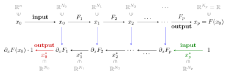

Backpropagation
=================================

Now that the main rules of GPU programming have been exposed, let us
**recap the fundamentals** of *backpropagation* or *reverse accumulation
AD*, the algorithm that allows Automatic Differentiation (AD) engines to
differentiate scalar-valued computer programs :math:`F : \mathbb{R}^n \to \mathbb{R}`
efficiently. As we uncover the methods that are hidden behind the
transparent `.grad()` calls of modern libraries, we will hopefully
allow the reader to get a clear understanding of the **rules** and
**limitations** of automatic differentiation engines.

Definitions 
--------------

**Differential.**
First of all, let us make our notations precise by recalling the
mathematical definition of the *differential* of a smooth function.
Let :math:`(X,\|\cdot\|_X)` and :math:`(Y,\|\cdot\|_Y)` be two normed
vector spaces. A function :math:`F : X \to Y` is said to be (Fréchet)
differentiable at :math:`x_0 \in X` if there exists a continuous linear
operator :math:`\mathcal{L} : X \to Y` such that:

.. math:: 
    \forall ~ \delta x \in X, \quad F(x_0 + \delta x ) 
    = F(x_0) + \mathcal{L}(\delta x) + o(\|\delta x\|_X)

or equivalently:

.. math:: 
    \lim\limits_{\delta x\to\, 0} \frac{ \|F(x_0 + \delta x) - F(x_0) 
    - \mathcal{L}(\delta x)\|_Y}{\|\delta x\|_X} = 0~.

If it exists, such a linear operator :math:`\mathcal{L}` is unique. It
is called the **differential** of :math:`F` at :math:`x_0` and is
denoted by :math:`\mathcal{L} = \mathrm{d}_x F(x_0)`. We use a dot symbol to
denote the application of :math:`\mathcal{L}`, as in

.. math::

   \begin{aligned}
   \mathcal{L}(\delta x) = \mathrm{d}_x F(x_0) \cdot \delta x.\end{aligned}

**Jacobian matrix.**
Let us consider the spaces :math:`X = \mathbb{R}^n` and :math:`Y = \mathbb{R}^m` endowed
with their usual (Euclidean) metric structures. Given a function
:math:`F = (F^1,\dots,F^m)` that is differentiable at a location
:math:`x_0` in :math:`\mathbb{R}^n`, the matrix of the linear operator
:math:`\mathrm{d}_x F(x_0)` in the canonical basis is the *Jacobian matrix* of
partial derivatives:

.. math::

   \begin{pmatrix}
   \frac{\partial F^1}{\partial x^1}(x_0) & \cdots & \frac{\partial F^1}{\partial x^n}(x_0)\\
   \vdots & \frac{\partial F^i}{\partial x^j}(x_0) & \vdots \\
   \frac{\partial F^m}{\partial x^1}(x_0) & \cdots & \frac{\partial F^m}{\partial x^n}(x_0)\\
   \end{pmatrix}.

**Gradient vector.**
When :math:`F` is scalar-valued (:math:`m = 1`), the Jacobian matrix is
a *line*: to retrieve a column *gradient vector* in :math:`\mathbb{R}^n`, one
usually considers its **transpose**. To define this manipulation in a way
that is **coordinate-free**, independent of the choice of a reference
basis, we must assume that :math:`X` is a *Hilbert space*: its metric
structure is *complete* and comes from an inner product
:math:`\langle\,\cdot\,,\,\cdot\,\rangle_X: X\times X \rightarrow \mathbb{R}`. 

Rigorously, let :math:`(X,~ \langle\,\cdot\,,\,\cdot\,\rangle_X)` be a Hilbert space,
:math:`x_0` a reference location in :math:`X` and :math:`F : X \to \mathbb{R}` a
function that is differentiable at :math:`x_0`. As its differential
:math:`\mathrm{d}_x F(x_0) : X \to \mathbb{R}` at :math:`x_0` is a *continuous linear
form*, the **Riesz representation theorem** ensures that there exists a
unique vector :math:`\nabla_x F(x_0) \in X`, the **gradient** of
:math:`F` at :math:`x_0` such that

.. math:: \forall ~ \delta x \in X, \quad \mathrm{d}_x F(x_0) \cdot \delta x = \langle\,\nabla_x F(x_0)\,,\,\delta x \,\rangle_X~.

Computing gradients
------------------------

A **naive** approach to the computation of gradient vectors, the so-called
**finite differences** scheme, is to use a Taylor expansion of :math:`F`
around :math:`x_0` and write that for small enough values of
:math:`\delta t`,

.. math::

   \begin{aligned}
   \nabla_x F(x_0)~~=~~
   \begin{pmatrix}
   \partial_{x^1} F(x_0) \\
   \partial_{x^2} F(x_0) \\
   \vdots \\
   \partial_{x^n} F(x_0) 
   \end{pmatrix}
   ~~\simeq~~
   \frac{1}{\delta t}
   \begin{pmatrix}
   F(x_0 + \delta t \cdot (1, 0, 0, \dots, 0)) - F(x_0) \\
   F(x_0 + \delta t \cdot (0, 1, 0, \dots, 0)) - F(x_0) \\
   \vdots \\
   F(x_0 + \delta t \cdot (0, 0, 0, \dots, 1)) - F(x_0) 
   \end{pmatrix}.\end{aligned}

This idea is simple to implement, but also requires :math:`(n+1)`
evaluations of the function \ :math:`F` to compute a *single* gradient
vector! As soon as the dimension :math:`n` of the input space exceeds 10
or 100, **this stops being tractable**: just like inverting a full matrix
:math:`A` is not a sensible way of solving the linear system
":math:`Ax = b`", one should not use finite differences - or any
equivalent *forward* method - to compute the gradient of a scalar-valued
objective.

**Generalized gradient.**
To go beyond this simple scheme, we need to work with the gradient of
*vector-valued* applications. Once again, coordinate-free definitions
rely on scalar products.
Let :math:`(X,~ \langle\,\cdot\,,\,\cdot\,\rangle_X)` and
:math:`(Y,~ \langle\,\cdot\,,\,\cdot\,\rangle_Y)` be two Hilbert spaces, and
let :math:`F : X\rightarrow Y` be a function that is differentiable at
:math:`x_0 \in X`. The adjoint

.. math:: (\mathrm{d}_x F)^*(x_0) : Y^* \rightarrow X^*

of the differential induces a continuous linear map

.. math:: \boldsymbol{\partial_x F(x_0) : Y \rightarrow X}

through the Riesz representation theorem, called the **generalized
gradient** of :math:`F` at :math:`x_0` with respect to the Hilbertian
structures of :math:`X` and \ :math:`Y`.

**Calculus.**
The generalized gradient appears in the infinitesimal development of
scalar quantities computed from :math:`F(x)` around a reference location
:math:`x_0`. Let :math:`\alpha \in Y^*` be a **continuous** linear form on
:math:`Y`, identified with a vector :math:`a \in Y` through the Riesz
representation theorem:

.. math:: \forall \, y\in Y, ~~\langle\,\alpha\,,\, y\,\rangle ~=~ \alpha(y) ~=~ \langle\,a\,,\, y\,\rangle_Y.

Then, for any increment :math:`\delta x \in X`, we can write that:

.. math::

   \begin{aligned}
   {8}
   \langle\alpha, F(x_0+\delta x)\rangle ~
   &=~ \langle\alpha, F(x_0)\rangle &~&+~ \langle\,~~\alpha,~~      \mathrm{d}_x F(x_0)\cdot \delta x~\rangle &~&+~o(\|\delta x\|_X) \\
   &=~ \langle\alpha, F(x_0)\rangle &~&+~ \langle\,(\mathrm{d}_x F)^*(x_0)\cdot \alpha,~  \delta x~\rangle &~&+~o(\|\delta x\|_X) \\
   \text{i.e.}~~
   \langle\,a, F(x_0+\delta x)\,\rangle_Y ~
   &=~ \langle\,a, F(x_0)\,\rangle_Y    &~&+~ \langle~~~\,\,\partial_x F(x_0)\cdot a,~ \delta x~\rangle_X &~&+~o(\|\delta x\|_X)~.\end{aligned}

**Fundamental example.**
If :math:`X` and :math:`Y` are respectively equal to :math:`\mathbb{R}^n`,
:math:`\mathbb{R}` and are endowed with the standard :math:`L^2`-Euclidean dot
products:

.. math::

   \begin{aligned}
   \langle\,x, x'\,\rangle_{\mathbb{R}^n} ~&=~ \sum_{i=1}^n x_i x'_i~
   &&
   \text{and}
   &
   \langle\,y, y'\,\rangle_{\mathbb{R}} ~&=~ y y'~,\end{aligned}

the matrix of :math:`\partial_x F(x_0):\mathbb{R}\rightarrow\mathbb{R}^n` in the
canonical basis is equal to the vector :math:`\nabla_x F(x_0)` of
directional derivatives:

.. math::

   \begin{aligned}
   \nabla_x F(x_0)~=~ \partial_x F(x_0) \,\cdot\, 1~.\end{aligned}

Going further, the matrix of the generalized gradient in the canonical
basis coincides with the transpose of the Jacobian matrix whenever the
scalar products considered are equal to the “canonical” ones. Everything
is consistent.

Metric structure, chain rule
--------------------------------

This generalized “metric” definition of the gradient has two major
advantages over the simple notion of “vector of partial derivatives”:

#. It stresses the fact that **a gradient is always defined with respect
   to a metric structure**, not a basis. In high-dimensional settings,
   as the equivalence of norms stops being effective, the choice of an
   appropriate *descent metric* becomes a **key regularization prior** for
   first-order optimization schemes. Encoded through a change of
   variables on the parameters that we strive to optimize, this
   modelling choice 
   `usually has a strong impact <https://www.mitpressjournals.org/doi/abs/10.1162/089976698300017746>`_ 
   on 
   `Machine Learning pipelines <https://dmitryulyanov.github.io/deep_image_prior>`_.
   |br|

#. It allows us to *compose* gradients without reserve. Indeed, if
   :math:`X`, :math:`Y`, :math:`Z` are three Hilbert spaces and if
   :math:`F = H \circ G` with :math:`G : X \rightarrow Y` and
   :math:`H : Y\rightarrow Z`, then for all :math:`x_0 \in X`, the chain
   rule asserts that

   .. math::

      \begin{aligned}
                  \mathrm{d}_x F(x_0) ~&=~ \mathrm{d}_y H(G(x_0)) \circ \mathrm{d}_x G(x_0)~,
                  \end{aligned}

   so that with the usual flip for the composition of adjoint (i.e.
   transposed) operators:

   .. math::

      \begin{aligned}
                                      \big[\mathrm{d}_x F(x_0)\big]^* ~&=~  \big[\mathrm{d}_x G(x_0)\big]^* \circ       \big[\mathrm{d}_y H(G(x_0))\big]^* \\
                  \text{i.e.}~~~~~~~~~~\partial_x F(x_0)~~~~&=~ ~\,\,\partial_x G(x_0) ~\,\,   \circ ~ \partial_y H(G(x_0)).
                  \end{aligned}

Backpropagation
--------------------

In practice, the function :math:`F : \mathbb{R}^n \rightarrow \mathbb{R}` to
differentiate is defined as a composition
:math:`F = F_p\circ\cdots\circ F_2\circ F_1` of elementary functions
:math:`F_i:\mathbb{R}^{N_{i-1}}\rightarrow \mathbb{R}^{N_i}` – the lines of our program
– where :math:`N_0 = n` and :math:`N_p = 1`:

To keep the notations simple, we now assume that all the input and
output spaces :math:`\mathbb{R}^{N_i}` are endowed with their canonical
:math:`L^2`-Euclidean metrics. The gradient vector
:math:`\nabla_x F(x_0)` that we strive to compute, at an arbitrary
location :math:`x_0\in\mathbb{R}^n`, is the image of :math:`1 \in \mathbb{R}` by the
linear map

.. math:: \partial_x F(x_0) : \mathbb{R} \rightarrow \mathbb{R}^n.

Thanks to the chain rule, we can write that:

.. math::

   \begin{aligned}
   \partial_x F(x_0) \cdot 1 ~&=~ 
   \partial_x F_1(x_0) \circ \partial_x F_2(F_1(x_0)) \circ \cdots \circ
   \partial_x F_p( \,F_{p-1}(\cdots(F_1(x_0))) \,) \cdot 1 \\
   &=~\partial_x F_1(x_0)\,\cdot\,  \partial_x F_2(~~\,~x_1~~\,~) \cdot\, \cdots \,\cdot
   \partial_x F_p( ~~~~~~~~~\,~~~x_{p-1}~~~~~~\,~~~~~) \cdot 1 \label{eq:backprop_fundamental}\end{aligned}

where the :math:`x_i\text{'s} = F_i\circ\cdots\circ F_1(x)` denote the
intermediate results in the computation of :math:`x_p = F(x_0)`.
Assuming that the *forward* and *backward* operators

.. math::

   \begin{aligned}
   &&&
   \begin{array}{ccccl}
           ~~~~~~F_i & : & ~~~~~\mathbb{R}^{N_{i-1}}~~~~ & \to & \mathbb{R}^{N_{i}} \\
            & & x & \mapsto & F_i(x)
       \end{array} \label{eq:forward_operator}
   \\
   \text{and}&&&
       \begin{array}{ccccl}
           \partial_x F_i & : & \mathbb{R}^{N_{i-1}}\times\mathbb{R}^{N_{i}} & \to & \mathbb{R}^{N_{i-1}} \\
            & & (x,a) & \mapsto & \partial_x F_i(x)\cdot a
       \end{array}\label{eq:backward_operator}\end{aligned}

are known and **encoded as computer programs**, we can thus compute
both :math:`F(x_0)` and
:math:`\nabla_x F(x_0) = \partial_x F(x_0) \cdot 1` with a
forward-backward pass through the following
diagram:

**In a nutshell.**
The *backpropagation* algorithm can be cut in two steps that correspond
to the two lines of the diagram above:

#. Starting from :math:`x_0 \in \mathbb{R}^n = \mathbb{R}^{N_0}`, compute and **store in
   memory** the successive vectors :math:`x_i \in \mathbb{R}^{N_i}`. The last
   one, :math:`x_p \in \mathbb{R}`, is equal to the value of the objective
   :math:`F(x_0)`.
   |br|

#. Starting from the canonical value of :math:`x_p^* = 1 \in \mathbb{R}`,
   compute the successive **dual vectors**:

   .. math:: x_i^* ~=~ \partial_x F_{i+1} (x_i) \cdot x_{i+1}^*~.

   The last one, :math:`x_0^* \in \mathbb{R}^n`, is equal to the gradient
   vector :math:`\nabla_x F(x_0) = \partial_x F(x_0) \cdot 1`.

**Implementation and performances.**
This forward-backward procedure can be generalized to all acyclic
computational graphs. Hence, provided that all forward and backward
operators
are implemented and available, we can compute *automatically* the
gradient of any symbolic procedure that is written as a succession of
elementary differentiable operations: the :math:`F_i`\ ’s.

In practice, the *backwards* of usual operations are seldom more costly
than 4-5 applications of the corresponding *forward* operators:
differentiating a polynomial gives us a polynomial, logarithms become
pointwise inversions, etc. Ergo, if one has enough memory at hand to
store the intermediate results :math:`x_0, \dots, x_{p-1}` during
the forward pass, **the backpropagation algorithm is an automatic and
time-effective way of computing the gradients** of generic scalar-valued
functions, with **runtimes that do not exceed that of four or five
applications of the forward program**. This statement may come as a
shock to first-time users of deep learning frameworks; but as we are
about to see, it is both *true* and *effective*.

.. |br| raw:: html

    

