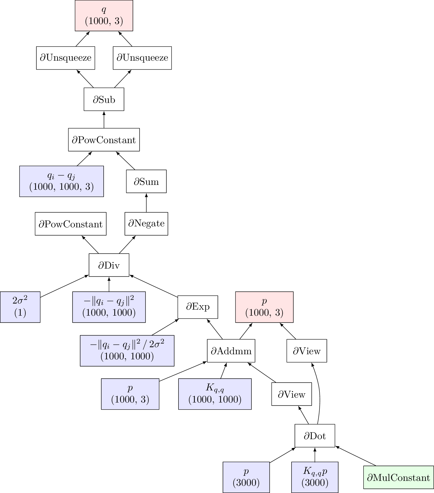

High-level frameworks
=================================

To provide a transparent interface for the backpropagation algorithm,
deep learning libraries rely on three core modules:

#. **A comprehensive list of operations**, with
   forward and backward routines implemented *next to each other*.

#. **Efficient GPU and CPU backends** for those routines, allowing users
   to take advantage of their hardware without having to write a single
   line of C++.

#. **A high-level graph manipulation engine** for symbolic computations,
   which executes the backpropagation’s “backward pass” whenever a
   gradient value is required.

A minimal working example
-------------------------------

Let us illustrate the underlying mechanics of PyTorch – the most
popular framework among academics – in a simple case: the computation
of the Gaussian *kernel norm*:

  .. math::

     \begin{aligned}
         H(q,p)~&=~ \frac{1}{2} \sum_{i,j=1}^\mathrm{N} k( q_i - q_j ) \, \langle\,p_i,p_j\,\rangle_{\mathbb{R}^\mathrm{D}} 
         & \text{where} & & k(x) ~=~& \exp(-\|x\|^2\,/\,2\sigma^2)\label{eq:hamiltonien_kernel2}\\
         &=~ \frac{1}{2} \langle\,p,\, K_{q,q}\, p\,\rangle_{\mathbb{R}^{\mathrm{N}\times\mathrm{D}}} & \text{where} & & (K_{q,q})_{i,j} ~&=~k( q_i - q_j ),\label{eq:hamiltonien_kernel3}\end{aligned}

and of its gradients with respect to the input arrays
:math:`(q_i) \in \mathbb{R}^{\mathrm{N}\times \mathrm{D}}` and
:math:`(p_i) \in \mathbb{R}^{\mathrm{N}\times \mathrm{D}}`. Using the standard (tensorized)
PyTorch interface, programmers may write:  

.. code-block:: python

    import torch                   # GPU + autodiff library
    from torchviz import make_dot  # See github.com/szagoruyko/pytorchviz

    # With PyTorch, using the GPU is that simple:
    use_gpu = torch.cuda.is_available()
    dtype   = torch.cuda.FloatTensor if use_gpu else torch.FloatTensor
    # Under the hood, this flag determines the backend that is to be
    # used for forward and backward operations, which have all been 
    # implemented both in pure CPU and GPU (CUDA) code.

    # Step 1: Define numerical tensors (from scratch or numpy) --------------------
    N, D = 1000, 3  # Work with clouds of 1,000 points in 3D
    # Generate arbitrary arrays on the host (CPU) or device (GPU):
    q = torch.rand(N, D).type(dtype)  # random tensor of shape (N,D)
    p = torch.rand(N, D).type(dtype)  # random tensor of shape (N,D)
    s = torch.Tensor([2.5]).type(dtype)  # deviation "sigma" of our kernel

    # Step 2: Ask PyTorch to keep track of q and p's children ---------------------
    # In this demo, we won't try to fine tune the kernel and
    # do not need any derivative with respect to sigma:
    q.requires_grad = True
    p.requires_grad = True

    # Step 3: Actual computations -------------------------------------------------
    # Every PyTorch instruction is executed on-the-fly, but the graph API
    # 'torch.autograd' keeps track of the operations and stores in memory
    # the intermediate results that are needed for the backward pass.
    q_i  = q[:,None,:]  # shape (N,D) -> (N,1,D)
    q_j  = q[None,:,:]  # shape (N,D) -> (1,N,D)
    D_ij  = ((q_i - q_j) ** 2).sum(dim=2)  # squared distances |q_i-q_j|^2
    K_ij = (- D_ij / (2 * s**2) ).exp()    # Gaussian kernel matrix
    v    = K_ij@p  # matrix multiplication. (N,N) @ (N,D) = (N,D)

    # Finally, compute the kernel norm H(q,p):
    H = .5 * torch.dot( p.view(-1), v.view(-1) ) # .5 * <p,v>

    # Display the computational graph in the figure below, annotated by hand:
    make_dot(H, {'q':q, 'p':p}).render(view=True)

Encoding formulas as tree-like objects
------------------------------------------

With PyTorch, tensor variables are much more than plain numerical
arrays. Any tensor that descends from a differentiable variable
(marked with the flag ``requires_grad = True``) possesses two essential attributes:  

    1. A :mod:`.data` pointer which refers to a C++ array that may be stored
       in either Host (CPU) or Device (GPU) memories.

    2. A :mod:`.grad_fn` recursive tree-like object, which records the
       **computational history** of the tensor and can be used whenever a
       backward pass is required by the :mod:`.grad()` operator.

In the picture above, we displayed the :mod:`H.grad_fn` attribute of
our kernel norm using the `GraphViz Dot program <http://www.graphviz.org/>`_. 
This acyclic graph is the exact
equivalent of the second “backward” line of the backpropagation
diagram that we presented in the previous section:

  -  **White nodes** stand for backward operators
     :math:`\partial_x F_{i+1} : (x_i,x_{i+1}^*) \mapsto x_i^*`.

  -  **The green leave** is the first covariable :math:`x_p^*\in \mathbb{R}`, the
     “gradient with respect to the output” that is initialized to 1 by
     default.

  -  **Red leaves** are the covariables “:math:`x_0^*`”, the gradients
     that we are about to compute.

  -  **Blue leaves** are the *stored* values :math:`x_i` that were
     computed during the forward pass.

A well-packaged backropagation engine
-------------------------------------------

Thanks to the groundwork done by the PyTorch symbolic engine,
computing gradients is now as simple as writing:

.. code-block:: python

    grad_q, grad_p = torch.autograd.grad( H, [q, p] )  # pair of (N,D) tensors

**That’s it – and it goes pretty fast!** As should be evident by now, the
blend of semi-symbolic calculus and parallel performances that deep
learning frameworks provide is a **game changer** for applied
mathematicians. Before going any further, we thus strongly advise
readers to try out these scripts on their machines and go through the
main `Matlab/NumPy to PyTorch migration guide <https://pytorch.org/tutorials/beginner/pytorch_with_examples.html>`_.

Custom operators, higher-order differentiation
------------------------------------------------------

As explained in this tutorial, creating new pairs of (forward, backward)
PyTorch operators is easy. Allowing users to inject their own
C++ code in a PyTorch program, the
:mod:`torch.autograd.Function` module is a convenient interface for the
developers of `PyTorch_Geometric <https://pytorch-geometric.readthedocs.io/en/latest/>`_, 
`GPytorch <https://gpytorch.ai/>`_
and other contributed extensions
to the vanilla framework.

Please note that the PyTorch engine also supports the computation of
**high-order gradients** through the ``create_graph = True`` optional argument of the
:func:`.grad()` operator. Even though full Hessian matrices may *not* be
computed efficiently using backprop-like strategies – they’re typically
way too large anyway – formulas that involve gradients may themselves be
understood as “vector computer programs” and differentiated accordingly.
In practice, developers of contributed libraries just have to make sure
that their *backward* operators rely on well-defined *forward* routines,
thus allowing the :mod:`autograd` engine to bootstrap the computation of
high-order derivatives.
