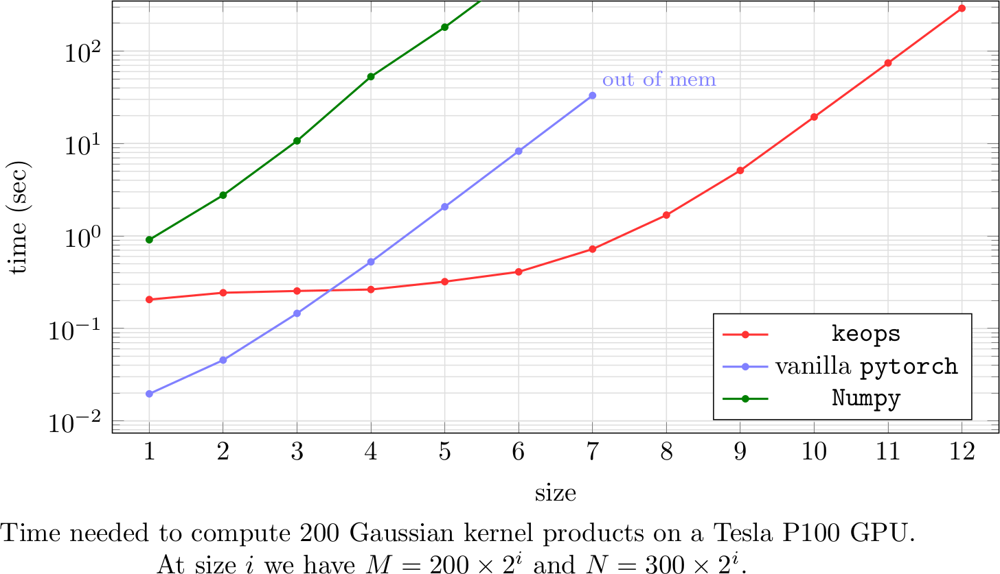

# KErnel OPerationS, on CPUs and GPUs, with autodiff and without memory overflows

```
          88           oooo    oooo             .oooooo.                                 88
        .8'`8.         `888   .8P'             d8P'  `Y8b                              .8'`8.
       .8'  `8.         888  d8'     .ooooo.  888      888 oo.ooooo.   .oooo.o        .8'  `8.
      .8'    `8.        88888[      d88' `88b 888      888  888' `88b d88(  "8       .8'    `8.
     .8'      `8.       888`88b.    888ooo888 888      888  888   888 `"Y88b.       .8'      `8.
    .8'        `8.      888  `88b.  888    .o `88b    d88'  888   888 o.  )88b     .8'        `8.
    88oooooooooo88     o888o  o888o `Y8bod8P'  `Y8bood8P'   888bod8P' 8""888P'     88oooooooooo88
                                                            888
                                                           o888o
```

## What is KeOps?

KeOps is a small plugin to pytorch, numpy, Matlab or R that enables
them to compute efficiently **Kernel dot products**
and other similar operations on the GPU.
It provides good performances, full differentiability
and linear (instead of quadratic) memory footprint through
a minimal interface: the `kernel_product` and `generic_sum` operations.

## Motivations

In recent years, Deep Learning frameworks such as
[Theano](http://deeplearning.net/software/theano/), [TensorFlow](http://www.tensorflow.org) 
or [PyTorch](http://pytorch.org) have evolved
into fully-fledged applied math libraries:
With negligible overhead, these tools now bring **automatic differentiation**
and **seamless GPU support** to research communities used
to array-centric frameworks -- Matlab and numpy.

Unfortunately, though, *no magic* is involved:
optimised CUDA codes still have to be written
for every atomic operation provided to end-users, and
supporting all the standard mathematical computations
thus comes at a **huge engineering cost** for the developers
of the main frameworks.
As of 2018, this considerable effort has been mostly restricted to the
operations needed to implement Convolutional Neural Networks:
linear algebra routines and *grid* convolutions.

As researchers focused on statistical shape analysis,
we thus got confronted with a **memory bottleneck** when trying
to compute Gaussian convolutions on meshes in $`\mathbb R^3`$
(aka. **RBF kernel product**). Given:

- a target point cloud $`(x_i)_{i=1}^N \in  \mathbb R^{N \times D}`$
- a source point cloud $`(y_j)_{j=1}^M \in  \mathbb R^{M \times D}`$
- a signal or vector field $`(b_j)_{j=1}^M \in  \mathbb R^{M \times E}`$ attached to the $`y_j`$'s

we strive to compute efficiently the array $`(a_i)_{i=1}^N \in  \mathbb R^{N \times E}`$ given by

```math
 a_i =  \sum_j K(x_i,y_j) b_j,  \qquad i=1,\cdots,N
```

where $`K(x_i,y_j) = \exp(-\|x_i - y_j\|^2 / \sigma^2)`$.

A standard way of doing so in array-centric frameworks is to
create and store in memory the full M-by-N kernel matrix $`K_{i,j}=K(x_i,y_j)`$,
before computing $`(a_i)`$ as the dot product between $`(K_{i,j})`$ and $`(b_j)`$.
This is all good for many users...
But as soon as we try to scale this method
to large datasets or point clouds (say, M and N >= 100,000),
it becomes intractable:
**huge 100,000-by-100,000 kernel matrices just don't fit in GPU memories**.

The purpose of KeOps, simply put, is to **let users break through this memory bottleneck**
by computing *online sum reductions*.
As we provide a simple `kernel_product` operator (+ a flexible, low-level `generic_sum` interface),
we hope that more and more researchers will come to enjoy the benefits of automatic differentiation
in their daily routines.



## What we provide

Let's say that you have at hand:

- a collection $`p^1`$, $`p^2`$, ..., $`p^P`$ of vectors.
- a collection $`x^1_i`$, $`x^2_i`$, ..., $`x^X_i`$ of vector sequences, indexed by an integer $`i`$ ranging from 1 to N.
- a collection $`y^1_j`$, $`y^2_j`$, ..., $`y^Y_j`$ of vector sequences, indexed by an integer $`j`$ ranging from 1 to M.

Then, referring to the p's as *parameters*, the x's as *x-variables*
and the y's as *y-variables*,
the KeOps library allows you to compute efficiently *any* expression $`a_i`$ of the form

```math
a_i = \text{Reduction}_{j=1..M} \big[ f(p^1, p^2, ..., x^1_i, x^2_i, ..., y^1_j, y^2_j, ...)  \big], \qquad i=1,\cdots,N
```

alongside its derivatives with respect to *all* the variables and parameters.

The core of KeOps relies on a set of **C++/CUDA routines**, for which we provide
**pytorch**, **numpy**, **MATLAB** and **R** (soon) bindings.
As of today, we support:

- Summation and (online, numerically stable) LogSumExp reductions.
- User-defined formulas, using a simple string format (`"gaussian(x,y) * (1+linear(u,v)**2)"`) or a custom low-level syntax (`"Exp(-G*SqDist(X,Y)) * ( IntCst(1) + Pow((U,V), 2) )"`).
- Simple syntax for kernels on feature spaces (say, locations+orientations varifold kernels used in shape analysis).
- High-order derivatives with respect to all parameters and variables.
- Non-radial kernels.

In future releases, we will focus on **performances**
and implement heuristics / search algorithms for optimized compilation parameters.

The library comes with various examples ranging from LDDMM theory (non rigid deformations) to kernel density estimations (non parametric statistics).
A **reference paper** will soon be put on Arxiv.

## Usage

We provide bindings in [python](./pykeops/pykeops.md)
(both [numpy](./pykeops/numpy/numpy_keops.md) and
[pytorch](./pykeops/torch/torch_keops.md) compliant),
[Matlab](./keopslab/keopslab.md) and R (soon).
By clicking on those links, you will get access to
your favorite binding's **install instructions**
and **full documentation**.
To conclude this general introduction, we now showcase
the use of the PyTorch interface in a typical situation.

### Computing Kernel dot-products

Coming back to the equations presented above,
we can compute a *fully differentiable* Gaussian-RBF kernel product
by typing:

```python
import torch
from pykeops.torch.kernels import Kernel, kernel_product

# Generate the data as pytorch tensors
x = torch.randn(1000,3, requires_grad=True)
y = torch.randn(2000,3, requires_grad=True)
b = torch.randn(2000,2, requires_grad=True)

# Pre-defined kernel: using custom expressions is also possible!
# Notice that the parameter sigma is a dim-1 vector, *not* a scalar:
sigma  = torch.tensor([.5], requires_grad=True)
params = {
    "id"      : Kernel("gaussian(x,y)"),
    "gamma"   : 1./sigma**2,
}

# Depending on the inputs' types, 'a' is a CPU or a GPU variable.
# It can be differentiated wrt. x, y, b and sigma.
a = kernel_product(params, x, y, b)
```

### Generic formulas

On top of the `kernel_product` operation (that covers
most of the typical use cases), we also provide a generic
low-level interface: it allows users to define
custom operations and reduce them using either
a summation or a log-sum-exp
(we plan to introduce max and min reductions in the future).

The `generic_sum` and `generic_logsumexp` operators take
as input a list of strings specifying the computation
and return a python function, callable on torch tensors.
The convention is that:

- The first string specifies the desired symbolic *formula*, using a [custom syntax](./generic_syntax.md).
- The second string specifies the *output*'s type using:
  - a (dummy) name;
  - a *category*, either `Vx` or `Vy` which indicates whether the output shall be indexed by i (with reduction over j) or vice-versa;
  - an integer dimension.
- The strings coming thereafter specify the *inputs*' types using:
  - an alphanumerical name, used in the *formula*;
  - a *category*, either `Vx` (indexation by i), `Vy` (indexation by j) or `Pm` (no indexation, the input tensor is a *vector* and not a 2D array);
  - an integer dimension.

Hence, using the low-level generic syntax, computing
a Gaussian-RBF kernel product can be done with:

```python
from pykeops.torch.generic_sum import generic_sum

gaussian_conv = generic_sum("Exp(-G*SqDist(X,Y)) * B", # f(g,x,y,b) = exp( -g*|x-y|^2 ) * b
                            "A = Vx(2)",  # The output is indexed by "i", of dim 2 -> summation over "j"
                            "G = Pm(1)",  # First arg  is a parameter,    of dim 1
                            "X = Vx(3)",  # Second arg is indexed by "i", of dim 3
                            "Y = Vy(3)",  # Third arg  is indexed by "j", of dim 3
                            "B = Vy(2)" ) # Fourth arg is indexed by "j", of dim 2
a = gaussian_conv( 1./sigma**2, x,y,b)
```

Details about the generic syntax can be found in the docfile [generic_syntax.md](./generic_syntax.md).

## Under the hood

In order to scale up on large datasets, we use a **tiled implementation** that allows us to get a $`O(N+M)`$ memory footprint instead of the usual $`O(NM)`$ codes generated by high level libraries - Thrust or cuda version of pyTorch and TensorFlow. CUDA kernels are compiled on-the-fly: one '.so' or '.dll' file is generated per mathematical expression, and can be re-used for other data samples and values of $`M`$ and $`N`$.

As of today, KeOps provides two backends:

- a naive pytorch implementation for the `kernel_product` method, that can be used on small samples and for testing purposes.
- a homemade C++/CUDA engine, located in the [`./keops/core`](./keops/core) folder. Automatic differentiation of formulas is performed using variadic templating.

We're currently investigating the possibility of developing a third backend, that would rely on a genuine CUDA library such as [Tensor Comprehensions](http://facebookresearch.github.io/TensorComprehensions/introduction.html).

------

Authors : [Benjamin Charlier](http://www.math.univ-montp2.fr/~charlier/), [Jean Feydy](http://www.math.ens.fr/~feydy/), [Joan Alexis Glaunès](http://www.mi.parisdescartes.fr/~glaunes/)
