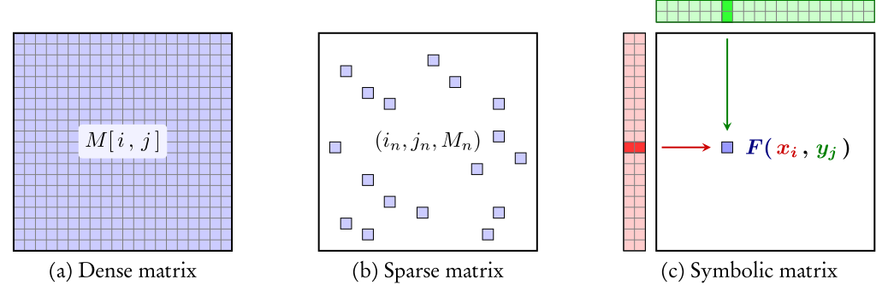

----------------------------------------------------------------------------------

[](https://ci.inria.fr/keops/job/keops/job/master/)
[](https://pypi.org/project/pykeops/)
[](https://cran.r-project.org/web/packages/rkeops/index.html)


You can visit KeOps official [website](https://www.kernel-operations.io/) for 
documentation and tutorials.

# Kernel Operations on the GPU, with autodiff, without memory overflows

The KeOps library lets you compute generic reductions of **very large arrays**
whose entries are given by a mathematical formula.
It combines a **tiled reduction scheme** with an **automatic differentiation**
engine, and can be used through **Matlab**, **Python** (NumPy or PyTorch) or
**R** backends.
It is perfectly suited to the computation of **Kernel matrix-vector products**
and the associated gradients,
even when the full kernel matrix does *not* fit into the GPU memory.



Math libraries understand variables as matrices,
also known as tensors.
(a) These are usually **dense** and encoded as
explicit numerical arrays that can have a large memory footprint.
(b) Alternatively, some operators can be encoded as
**sparse matrices**: libraries store in memory the indices
(i<sub>n</sub>,j<sub>n</sub>) and 
values M<sub>n</sub> = M<sub>i<sub>n</sub>,j<sub>n</sub></sub>
that correspond to a small number
of non-zero coefficients.
Reduction operations are then implemented using
indexing methods and scattered memory accesses.
(c) **We provide support for a third class of tensors:**
**symbolic matrices** whose coefficients
are given by a formula
M<sub>i,j</sub> = F(x<sub>i</sub>,y<sub>j</sub>) that is evaluated on
data arrays (x<sub>i</sub>) and (y<sub>j</sub>).
Reduction operations are implemented using
parallel schemes that compute the coefficients M<sub>i,j</sub>
on-the-fly.
We take advantage of the structure of CUDA registers
to bypass costly memory transfers
and achieve optimal runtimes on a wide range of applications.

Using the **PyTorch backend**, a typical sample of code looks like:

```python
# Create two arrays with 3 columns and a (huge) number of lines, on the GPU
import torch
x = torch.randn(1000000, 3, requires_grad=True).cuda()
y = torch.randn(2000000, 3).cuda()

# Turn our Tensors into KeOps symbolic variables:
from pykeops.torch import LazyTensor
x_i = LazyTensor( x[:,None,:] )  # x_i.shape = (1e6, 1, 3)
y_j = LazyTensor( y[None,:,:] )  # y_j.shape = ( 1, 2e6,3)

# We can now perform large-scale computations, without memory overflows:
D_ij = ((x_i - y_j)**2).sum(dim=2)  # Symbolic (1e6,2e6,1) matrix of squared distances
K_ij = (- D_ij).exp()               # Symbolic (1e6,2e6,1) Gaussian kernel matrix

# And come back to vanilla PyTorch Tensors or NumPy arrays using
# reduction operations such as .sum(), .logsumexp() or .argmin().
# Here, the kernel density estimation   a_i = sum_j exp(-|x_i-y_j|^2)
# is computed using a CUDA online map-reduce routine that has a linear
# memory footprint and outperforms standard PyTorch implementations
# by two orders of magnitude.
a_i = K_ij.sum(dim=1)  # Genuine torch.cuda.FloatTensor, a_i.shape = (1e6, 1),
g_x = torch.autograd.grad((a_i ** 2).sum(), [x])  # KeOps supports autograd!
```

KeOps allows you to leverage your GPU without compromising on usability.
It provides:

* **Linear** (instead of quadratic) **memory footprint** for Kernel operations.
* Support for a wide range of mathematical **formulas**.
* Seamless computation of **derivatives**, up to arbitrary orders.
* Sum, LogSumExp, Min, Max but also ArgMin, ArgMax or K-min **reductions**.
* A **conjugate gradient solver** for e.g. large-scale spline interpolation or kriging, Gaussian process regression.
* An interface for **block-sparse** and coarse-to-fine strategies.
* Support for **multi GPU** configurations.

KeOps can thus be used in a wide variety of settings,
from shape analysis (LDDMM, optimal transport...)
to machine learning (kernel methods, k-means...)
or kriging (aka. Gaussian process regression).
More details are provided below:

* [Installation](http://www.kernel-operations.io/keops/introduction/installation.html)
* [Documentation](http://www.kernel-operations.io/keops/introduction/why_using_keops.html)
* [Learning KeOps with tutorials](http://www.kernel-operations.io/keops/_auto_tutorials/index.html)
* [Gallery of examples](http://www.kernel-operations.io/keops/_auto_examples/index.html)
* [Benchmarks](http://www.kernel-operations.io/keops/_auto_benchmarks/index.html)

# Benchmark

KeOps is one of the fastest solution to compute generic Kernel formula. See our [benchmark](./benchmarks/README.md)

# How to cite

When using KeOps for your scientific work, please cite the [preprint](https://hal.archives-ouvertes.fr/hal-02517462) or directly use the following bibtex:

```tex
@article{charlier2020kernel,
  title={Kernel operations on the {GPU}, with autodiff, without memory overflows},
  author={Charlier, Benjamin and Feydy, Jean and Glaun{\`e}s, Joan Alexis and Collin, Fran{\c{c}}ois-David and Durif, Ghislain},
  journal={arXiv preprint arXiv:2004.11127},
  year={2020}
}
```

# Projects using KeOps

As of today, KeOps provides core routines for:

* [Deformetrica](http://www.deformetrica.org), a shape analysis software
  developed by the [Aramis](https://www.inria.fr/en/teams/aramis) Inria team.
* [GeomLoss](http://www.kernel-operations.io/geomloss), a multiscale
  implementation of Kernel and **Wasserstein distances** that scales up to
  **millions of samples** on modern hardware.
* [FshapesTk](https://plmlab.math.cnrs.fr/benjamin.charlier/fshapesTk) and the
  [Shapes toolbox](https://plmlab.math.cnrs.fr/jeanfeydy/shapes_toolbox),
  two research-oriented [LDDMM](https://en.wikipedia.org/wiki/Large_deformation_diffeomorphic_metric_mapping) toolkits.

# Authors

Feel free to contact us for any bug report or feature request, you can also fill 
an issue report on [GitHub](https://github.com/getkeops/keops/issues).

## KeOps, PyKeOps, KeOpsLab

- [Benjamin Charlier](https://imag.umontpellier.fr/~charlier/)
- [Jean Feydy](https://www.jeanfeydy.com)
- [Joan Alexis Glaunès](http://helios.mi.parisdescartes.fr/~glaunes/)

## RKeOps

- [Ghislain Durif](https://gdurif.perso.math.cnrs.fr/)

## Contributors

- François-David Collin
